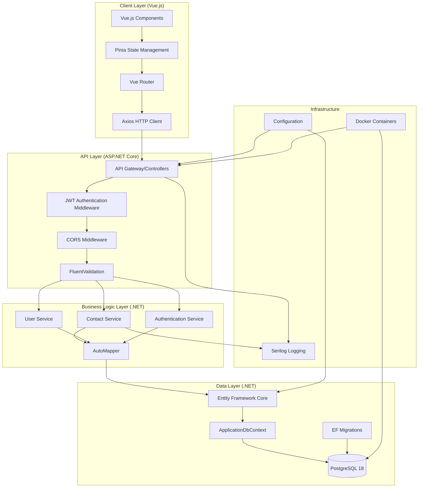
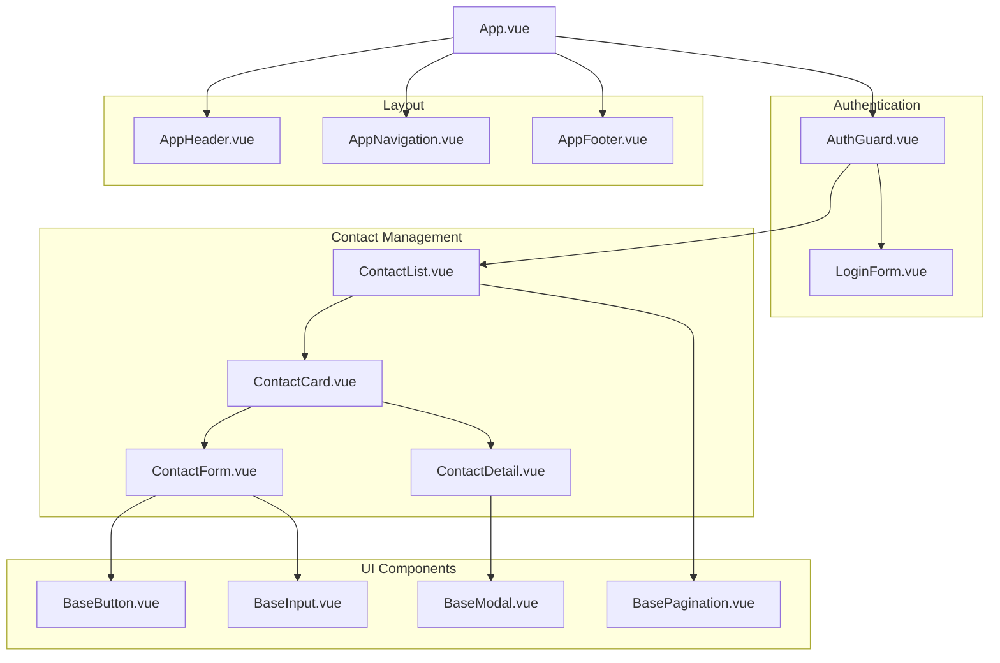

# 住所録WEBアプリケーション 技術設計書

## 概要

住所録WEBアプリケーションは、個人や組織の連絡先情報を効率的に管理するためのモダンなWEBベースシステムです。本設計では、セキュリティ、パフォーマンス、保守性を重視したアーキテクチャを採用し、Vue.js、ASP.NET Core、PostgreSQLを中心とした技術スタックで実装します。

### 主要機能
- ユーザー認証とセッション管理
- 連絡先のCRUD操作（作成、読み取り、更新、削除）
- データの永続化とバックアップ
- レスポンシブデザイン対応
- 包括的なデータ検証
- エンタープライズレベルのセキュリティ

### 技術スタック
- **フロントエンド**: Vue.js 3 with TypeScript
- **バックエンド**: C# + ASP.NET Core 10.0 (LTS)
- **データベース**: PostgreSQL 18+ (Entity Framework Core 10.0)
- **認証**: JWT + ASP.NET Core Identity
- **スタイリング**: Tailwind CSS 4.x
- **開発ツール**: 
  - **エディタ**: Visual Studio Code
  - **ランタイム**: .NET CLI, Node.js
  - **ビルドツール**: Vite (フロントエンド), MSBuild (バックエンド)
  - **パッケージ管理**: npm/pnpm (フロントエンド), NuGet (バックエンド)
  - **コード品質**: ESLint, Prettier (フロントエンド), EditorConfig
  - **テスト**: Vitest (フロントエンド), xUnit (バックエンド)
  - **データベース管理**: Entity Framework CLI, pgAdmin
  - **コンテナ**: Docker, Docker Compose
  - **バージョン管理**: Git

## アーキテクチャ

### システムアーキテクチャ



### レイヤー構成

#### 1. プレゼンテーション層（Vue.js Frontend）
- **責任**: ユーザーインターフェース、ユーザー体験、状態管理
- **技術**: Vue.js 3, TypeScript, Tailwind CSS 4.x, Vue Router, Pinia, Axios
- **パターン**: Component-based architecture, Composition API, Reactive state management

#### 2. API層（ASP.NET Core Backend）
- **責任**: HTTPリクエスト処理、認証、バリデーション、ルーティング、CORS
- **技術**: ASP.NET Core 10.0, JWT, ASP.NET Core Identity, FluentValidation, Serilog
- **パターン**: RESTful API, Middleware pattern, Controller pattern, Dependency Injection

#### 3. ビジネスロジック層
- **責任**: アプリケーションロジック、ビジネスルール、データ変換
- **技術**: C#, Service pattern, AutoMapper
- **パターン**: Service layer, Repository pattern

#### 4. データアクセス層
- **責任**: データ永続化、クエリ最適化、トランザクション管理、マイグレーション
- **技術**: PostgreSQL 18, Entity Framework Core 10.0, ApplicationDbContext
- **パターン**: Repository pattern, Unit of Work, Code-First migrations

## コンポーネントとインターフェース

### フロントエンドコンポーネント構成



### APIエンドポイント設計

#### 認証エンドポイント
```csharp
// POST /api/auth/login
public class LoginRequest
{
    public string Email { get; set; }
    public string Password { get; set; }
}

public class LoginResponse
{
    public string Token { get; set; }
    public UserDto User { get; set; }
    public DateTime ExpiresAt { get; set; }
}

// POST /api/auth/logout
// DELETE /api/auth/session
```

#### 連絡先エンドポイント
```csharp
// GET /api/contacts?page=1&limit=50
public class ContactListResponse
{
    public List<ContactDto> Contacts { get; set; }
    public PaginationDto Pagination { get; set; }
}

// POST /api/contacts
public class CreateContactRequest
{
    public string Name { get; set; }
    public string? Address { get; set; }
    public string? PhoneNumber { get; set; }
}

// PUT /api/contacts/{id}
public class UpdateContactRequest
{
    public string Name { get; set; }
    public string? Address { get; set; }
    public string? PhoneNumber { get; set; }
}

// DELETE /api/contacts/{id}
```

### データベーススキーマ

```sql
-- Users table
CREATE TABLE users (
    id UUID PRIMARY KEY DEFAULT gen_random_uuid(),
    email VARCHAR(255) UNIQUE NOT NULL,
    password_hash VARCHAR(255) NOT NULL,
    created_at TIMESTAMP WITH TIME ZONE DEFAULT NOW(),
    updated_at TIMESTAMP WITH TIME ZONE DEFAULT NOW(),
    last_login TIMESTAMP WITH TIME ZONE,
    failed_login_attempts INTEGER DEFAULT 0,
    locked_until TIMESTAMP WITH TIME ZONE
);

-- Contacts table
CREATE TABLE contacts (
    id UUID PRIMARY KEY DEFAULT gen_random_uuid(),
    user_id UUID NOT NULL REFERENCES users(id) ON DELETE CASCADE,
    name VARCHAR(100) NOT NULL,
    address VARCHAR(500),
    phone_number VARCHAR(20),
    created_at TIMESTAMP WITH TIME ZONE DEFAULT NOW(),
    updated_at TIMESTAMP WITH TIME ZONE DEFAULT NOW(),
    UNIQUE(user_id, name)
);

-- Audit log table
CREATE TABLE audit_logs (
    id UUID PRIMARY KEY DEFAULT gen_random_uuid(),
    user_id UUID REFERENCES users(id) ON DELETE SET NULL,
    action VARCHAR(50) NOT NULL,
    resource_type VARCHAR(50) NOT NULL,
    resource_id UUID,
    ip_address INET,
    user_agent TEXT,
    created_at TIMESTAMP WITH TIME ZONE DEFAULT NOW()
);

-- Indexes for performance
CREATE INDEX idx_contacts_user_id ON contacts(user_id);
CREATE INDEX idx_contacts_name ON contacts(name);
CREATE INDEX idx_audit_logs_user_id ON audit_logs(user_id);
CREATE INDEX idx_audit_logs_created_at ON audit_logs(created_at);
```

## データモデル

### Core Entities

#### User Entity
```csharp
public class User
{
    public Guid Id { get; set; }
    public string Email { get; set; }
    public string PasswordHash { get; set; }
    public DateTime CreatedAt { get; set; }
    public DateTime UpdatedAt { get; set; }
    public DateTime? LastLogin { get; set; }
    public int FailedLoginAttempts { get; set; }
    public DateTime? LockedUntil { get; set; }
    
    public ICollection<Contact> Contacts { get; set; }
}
```

#### Contact Entity
```csharp
public class Contact
{
    public Guid Id { get; set; }
    public Guid UserId { get; set; }
    public string Name { get; set; }
    public string? Address { get; set; }
    public string? PhoneNumber { get; set; }
    public DateTime CreatedAt { get; set; }
    public DateTime UpdatedAt { get; set; }
    
    public User User { get; set; }
}
```

#### AuditLog Entity
```csharp
public class AuditLog
{
    public Guid Id { get; set; }
    public Guid? UserId { get; set; }
    public string Action { get; set; }
    public string ResourceType { get; set; }
    public Guid? ResourceId { get; set; }
    public string? IpAddress { get; set; }
    public string? UserAgent { get; set; }
    public DateTime CreatedAt { get; set; }
}
```

### バリデーションルール

#### Contact Validation
```csharp
public class ContactValidator : AbstractValidator<CreateContactRequest>
{
    public ContactValidator()
    {
        RuleFor(x => x.Name)
            .NotEmpty().WithMessage("名前は必須です")
            .Length(1, 100).WithMessage("名前は1文字以上100文字以下で入力してください")
            .Matches(@"^[^\s].*[^\s]$").WithMessage("名前の前後に空白は使用できません");
            
        RuleFor(x => x.Address)
            .MaximumLength(500).WithMessage("住所は500文字以下で入力してください")
            .When(x => !string.IsNullOrEmpty(x.Address));
            
        RuleFor(x => x.PhoneNumber)
            .MaximumLength(20).WithMessage("電話番号は20文字以下で入力してください")
            .Matches(@"^(\(\d{3}\)\s?\d{3}-\d{4}|\d{3}-\d{3}-\d{4}|\d{3}\.\d{3}\.\d{4}|\+\d{1}-\d{3}-\d{3}-\d{4}|\d{10})$")
            .WithMessage("有効な電話番号を入力してください")
            .When(x => !string.IsNullOrEmpty(x.PhoneNumber));
    }
}
```

#### User Validation
```csharp
public class UserValidator : AbstractValidator<RegisterRequest>
{
    public UserValidator()
    {
        RuleFor(x => x.Email)
            .NotEmpty().WithMessage("メールアドレスは必須です")
            .EmailAddress().WithMessage("有効なメールアドレスを入力してください")
            .MaximumLength(255).WithMessage("メールアドレスは255文字以下で入力してください");
            
        RuleFor(x => x.Password)
            .NotEmpty().WithMessage("パスワードは必須です")
            .MinimumLength(8).WithMessage("パスワードは8文字以上で入力してください")
            .Matches(@"^(?=.*[a-z])(?=.*[A-Z])(?=.*\d)(?=.*[@$!%*?&])[A-Za-z\d@$!%*?&]")
            .WithMessage("パスワードは大文字、小文字、数字、特殊文字を含む必要があります");
    }
}
```

## 正確性プロパティ

*プロパティとは、システムのすべての有効な実行において真であるべき特性や動作のことです。本質的に、システムが何をすべきかについての形式的な記述です。プロパティは、人間が読める仕様と機械で検証可能な正確性保証の橋渡しとして機能します。*

### プロパティリフレクション

プロパティ分析を確認した結果、以下の冗長性を特定しました：

- 要件2.1と要件2.4は両方とも連絡先作成に関するものですが、異なる側面（基本作成 vs 重複チェック）をテストするため、両方とも保持します
- 要件2.5と要件2.8は両方とも検証に関するものですが、異なる検証ルール（一般的な検証 vs 電話番号形式）をテストするため、両方とも保持します
- 要件8.1と要件2.8は同じ電話番号検証をテストしているため、要件8.1を削除し、要件2.8に統合します
- 要件8.2と要件2.4は同じ重複チェックをテストしているため、要件8.2を削除し、要件2.4に統合します

### プロパティ1: 連絡先作成の基本機能

*任意の*有効な名前（1-100文字）に対して、連絡先作成操作は成功し、データベースに正しく保存される

**検証対象: 要件 2.1**

### プロパティ2: 連絡先名の重複防止

*任意の*ユーザーと既存の連絡先名に対して、同じ名前（大文字小文字を区別しない）で新しい連絡先を作成しようとすると、システムは拒否し、「この名前の連絡先は既に存在します」エラーを表示する

**検証対象: 要件 2.4, 8.2**

### プロパティ3: 入力検証エラーハンドリング

*任意の*無効なデータ（空の名前、フィールド長超過、無効な電話番号形式）に対して、システムは保存せずに具体的な検証エラーを表示する

**検証対象: 要件 2.5, 2.8, 8.1, 8.3**

### プロパティ4: 連絡先リストのソート機能

*任意の*連絡先の集合に対して、連絡先リストは名前のアルファベット順（大文字小文字を区別しない）で正しくソートされて表示される

**検証対象: 要件 3.1**

### プロパティ5: 連絡先更新の基本機能

*任意の*既存の連絡先と有効な変更データに対して、更新操作は成功し、データベースに正しく反映される

**検証対象: 要件 4.2**

### プロパティ6: 更新時の入力検証

*任意の*無効な変更データに対して、システムは保存せずに具体的なフィールド検証エラーを表示する

**検証対象: 要件 4.3**

### プロパティ7: データ永続化の保証

*任意の*連絡先データに対して、明示的に削除されるまで、すべての連絡先情報（名前、住所、電話番号、作成日、最終更新日）が永続的に保持される

**検証対象: 要件 6.1**

### プロパティ8: 認可とアクセス制御

*任意の*ユーザーと連絡先の組み合わせに対して、ユーザーは自分が所有する連絡先のみにアクセス可能で、他のユーザーの連絡先にはアクセスできない

**検証対象: 要件 9.1**

## エラーハンドリング

### エラー分類と処理戦略

#### 1. バリデーションエラー
```csharp
public class ValidationError
{
    public string Field { get; set; }
    public string Message { get; set; }
    public ValidationErrorCode Code { get; set; }
}

public enum ValidationErrorCode
{
    Required,
    TooLong,
    TooShort,
    InvalidFormat,
    Duplicate
}

// 例: 名前フィールドのバリデーションエラー
new ValidationError
{
    Field = "name",
    Message = "名前は1文字以上100文字以下で入力してください",
    Code = ValidationErrorCode.TooLong
}
```

#### 2. 認証・認可エラー
```csharp
public class AuthError
{
    public AuthErrorType Type { get; set; }
    public string Message { get; set; }
    public int? RetryAfter { get; set; } // アカウントロック時の再試行可能時間
}

public enum AuthErrorType
{
    Authentication,
    Authorization,
    SessionExpired,
    AccountLocked
}

// 例: アカウントロックエラー
new AuthError
{
    Type = AuthErrorType.AccountLocked,
    Message = "アカウントがロックされています。30分後に再試行してください。",
    RetryAfter = 1800 // 30分（秒）
}
```

#### 3. システムエラー
```csharp
public class SystemError
{
    public SystemErrorType Type { get; set; }
    public string Message { get; set; }
    public string ErrorId { get; set; } // ログ追跡用のユニークID
    public DateTime Timestamp { get; set; }
}

public enum SystemErrorType
{
    DatabaseError,
    NetworkError,
    InternalError
}

// 例: データベースエラー
new SystemError
{
    Type = SystemErrorType.DatabaseError,
    Message = "システムエラーが発生しました。もう一度お試しください。",
    ErrorId = "err_2024_001_abc123",
    Timestamp = DateTime.UtcNow
}
```

### エラーハンドリング戦略

#### フロントエンド
- **グローバルエラーハンドラー**: Vue.js Error Handlingを使用
- **API エラーハンドリング**: Axiosインターセプターで統一処理
- **ユーザーフレンドリーメッセージ**: 技術的詳細を隠蔽
- **エラー状態の管理**: Piniaでグローバル状態管理

#### バックエンド
- **構造化ログ**: Serilog + JSON形式でログ出力
- **エラー追跡**: 各エラーにユニークIDを付与
- **レート制限**: ASP.NET Core Rate LimitingでDDoS対策
- **グレースフルシャットダウン**: IHostApplicationLifetimeでシャットダウンハンドリング

### 監査ログ

```csharp
public class AuditLogEntry
{
    public Guid Id { get; set; }
    public Guid? UserId { get; set; }
    public AuditAction Action { get; set; }
    public ResourceType ResourceType { get; set; }
    public Guid? ResourceId { get; set; }
    public string? IpAddress { get; set; }
    public string? UserAgent { get; set; }
    public bool Success { get; set; }
    public string? ErrorMessage { get; set; }
    public DateTime Timestamp { get; set; }
}

public enum AuditAction
{
    Create,
    Read,
    Update,
    Delete,
    Login,
    Logout
}

public enum ResourceType
{
    Contact,
    User,
    Session
}
```

## テスト戦略

### テストピラミッド

```mermaid
graph TD
    subgraph "テストピラミッド"
        E2E[E2Eテスト<br/>Playwright<br/>10-15%]
        Integration[統合テスト<br/>ASP.NET Core Test Host + Testcontainers<br/>20-25%]
        Unit[単体テスト<br/>Vitest + Vue Test Utils (Frontend)<br/>xUnit + Moq (Backend)<br/>60-70%]
    end
    
    Unit --> Integration
    Integration --> E2E
```

### 1. 単体テスト（60-70%）

#### フロントエンド単体テスト
- **フレームワーク**: Vitest + Vue Test Utils
- **対象**: コンポーネント、Composables、ユーティリティ関数
- **カバレッジ目標**: 90%以上

```typescript
// 例: ContactForm コンポーネントのテスト
describe('ContactForm.vue', () => {
  test('有効なデータで連絡先を作成できる', async () => {
    const wrapper = mount(ContactForm, {
      props: { onSubmit: mockSubmit }
    });
    
    await wrapper.find('[data-testid="contact-name"]').setValue('田中太郎');
    await wrapper.find('[data-testid="save-button"]').trigger('click');
    
    expect(mockSubmit).toHaveBeenCalledWith({
      name: '田中太郎',
      address: '',
      phoneNumber: ''
    });
  });
});
```

#### バックエンド単体テスト
- **フレームワーク**: xUnit + Moq
- **対象**: サービス層、コントローラー、ユーティリティ関数
- **モック**: データベース、外部API

```csharp
// 例: ContactService のテスト
[Fact]
public async Task CreateContact_ValidData_ReturnsContact()
{
    // Arrange
    var mockRepository = new Mock<IContactRepository>();
    var mockContact = new Contact { Id = Guid.NewGuid(), Name = "田中太郎" };
    mockRepository.Setup(r => r.CreateAsync(It.IsAny<Contact>()))
              .ReturnsAsync(mockContact);
    mockRepository.Setup(r => r.FindByNameAsync(It.IsAny<Guid>(), It.IsAny<string>()))
              .ReturnsAsync((Contact?)null);
    
    var service = new ContactService(mockRepository.Object);
    var contactData = new CreateContactRequest { Name = "田中太郎" };
    
    // Act
    var result = await service.CreateContactAsync(userId, contactData);
    
    // Assert
    Assert.Equal(mockContact.Name, result.Name);
    mockRepository.Verify(r => r.CreateAsync(It.IsAny<Contact>()), Times.Once);
}
```

### 2. プロパティベーステスト（正確性プロパティ用）

#### 設定
- **フレームワーク**: FsCheck (.NET) / fast-check (TypeScript)
- **実行回数**: 各プロパティテストあたり最低100回
- **タグ形式**: `Feature: address-book-webapp, Property {number}: {property_text}`

```csharp
// 例: プロパティ1のテスト
[Fact]
public void Property1_ContactCreation_AlwaysSucceedsWithValidName()
{
    Prop.ForAll(
        Arb.Default.NonEmptyString()
           .Filter(s => s.Get.Length >= 1 && s.Get.Length <= 100 && s.Get.Trim().Length > 0),
        Arb.Default.Option<string>(),
        ValidPhoneNumberArbitrary(),
        async (name, address, phoneNumber) =>
        {
            // Arrange
            var contactData = new CreateContactRequest 
            { 
                Name = name.Get.Trim(), 
                Address = address?.Item, 
                PhoneNumber = phoneNumber?.Item 
            };
            
            // Act
            var result = await contactService.CreateContactAsync(userId, contactData);
            
            // Assert
            // データベースに正しく保存されることを検証
            var saved = await contactRepository.FindByIdAsync(result.Id);
            Assert.Equal(contactData.Name, saved.Name);
            Assert.Equal(contactData.Address, saved.Address);
            Assert.Equal(contactData.PhoneNumber, saved.PhoneNumber);
        })
    .QuickCheckThrowOnFailure();
}
```

### 3. 統合テスト（20-25%）

#### API統合テスト
- **フレームワーク**: ASP.NET Core Test Host + Testcontainers
- **対象**: APIエンドポイント、データベース連携
- **環境**: Docker化されたPostgreSQL

```csharp
// 例: 連絡先API統合テスト
public class ContactApiIntegrationTests : IClassFixture<WebApplicationFactory<Program>>
{
    private readonly WebApplicationFactory<Program> _factory;
    private readonly PostgreSqlContainer _container;
    
    public ContactApiIntegrationTests(WebApplicationFactory<Program> factory)
    {
        _factory = factory;
        _container = new PostgreSqlBuilder().Build();
    }
    
    [Fact]
    public async Task PostContacts_CreateContact_ReturnsCreatedContact()
    {
        // Arrange
        await _container.StartAsync();
        var client = _factory.CreateClient();
        var contactData = new CreateContactRequest
        {
            Name = "田中太郎",
            Address = "東京都渋谷区",
            PhoneNumber = "03-1234-5678"
        };
        
        // Act
        var response = await client.PostAsJsonAsync("/api/contacts", contactData);
        
        // Assert
        response.EnsureSuccessStatusCode();
        var result = await response.Content.ReadFromJsonAsync<ContactDto>();
        Assert.Equal("田中太郎", result.Name);
        
        // データベースに実際に保存されているか確認
        using var scope = _factory.Services.CreateScope();
        var context = scope.ServiceProvider.GetRequiredService<ApplicationDbContext>();
        var saved = await context.Contacts.FindAsync(result.Id);
        Assert.NotNull(saved);
    }
}
```

### 4. E2Eテスト（10-15%）

#### ユーザージャーニーテスト
- **フレームワーク**: Playwright
- **対象**: 主要なユーザーフロー
- **環境**: 本番環境に近いステージング環境

```typescript
// 例: 連絡先管理フローのE2Eテスト
test('連絡先の作成から削除までの完全フロー', async ({ page }) => {
  // ログイン
  await page.goto('/login');
  await page.fill('[data-testid=email]', 'test@example.com');
  await page.fill('[data-testid=password]', 'password123');
  await page.click('[data-testid=login-button]');
  
  // 連絡先作成
  await page.click('[data-testid=add-contact-button]');
  await page.fill('[data-testid=contact-name]', '田中太郎');
  await page.fill('[data-testid=contact-phone]', '03-1234-5678');
  await page.click('[data-testid=save-contact-button]');
  
  // 連絡先が一覧に表示されることを確認
  await expect(page.locator('[data-testid=contact-list]')).toContainText('田中太郎');
  
  // 連絡先編集
  await page.click('[data-testid=edit-contact-button]');
  await page.fill('[data-testid=contact-address]', '東京都渋谷区');
  await page.click('[data-testid=save-contact-button]');
  
  // 連絡先削除
  await page.click('[data-testid=delete-contact-button]');
  await page.click('[data-testid=confirm-delete-button]');
  
  // 連絡先が一覧から削除されることを確認
  await expect(page.locator('[data-testid=contact-list]')).not.toContainText('田中太郎');
});
```

### パフォーマンステスト

#### 負荷テスト
- **ツール**: Artillery.io
- **目標**: 100同時ユーザー
- **シナリオ**: 連絡先CRUD操作の混合ワークロード

```yaml
# artillery-config.yml
config:
  target: 'http://localhost:3000'
  phases:
    - duration: 60
      arrivalRate: 10
      name: "Warm up"
    - duration: 300
      arrivalRate: 50
      name: "Load test"
  
scenarios:
  - name: "Contact CRUD operations"
    weight: 100
    flow:
      - post:
          url: "/api/auth/login"
          json:
            email: "test@example.com"
            password: "password123"
          capture:
            - json: "$.token"
              as: "authToken"
      - get:
          url: "/api/contacts"
          headers:
            Authorization: "Bearer {{ authToken }}"
      - post:
          url: "/api/contacts"
          headers:
            Authorization: "Bearer {{ authToken }}"
          json:
            name: "Test Contact {{ $randomString() }}"
            phoneNumber: "03-1234-5678"
```

### セキュリティテスト

#### 脆弱性テスト
- **ツール**: OWASP ZAP, npm audit
- **対象**: SQLインジェクション、XSS、CSRF、認証バイパス
- **頻度**: CI/CDパイプラインで自動実行

### テスト環境とCI/CD

#### テスト環境
```yaml
# docker-compose.test.yml
version: '3.8'
services:
  test-db:
    image: postgres:18
    environment:
      POSTGRES_DB: address_book_test
      POSTGRES_USER: test
      POSTGRES_PASSWORD: test
    ports:
      - "5433:5432"
  
  test-app:
    build: .
    environment:
      ASPNETCORE_ENVIRONMENT: Testing
      ConnectionStrings__DefaultConnection: "Host=test-db;Database=address_book_test;Username=test;Password=test"
    depends_on:
      - test-db
```

#### CI/CDパイプライン
```yaml
# .github/workflows/test.yml
name: Test Suite
on: [push, pull_request]

jobs:
  test:
    runs-on: ubuntu-latest
    steps:
      - uses: actions/checkout@v3
      - uses: actions/setup-dotnet@v3
        with:
          dotnet-version: '10.0'
      - uses: actions/setup-node@v3
        with:
          node-version: '18'
      
      - name: Restore .NET dependencies
        run: dotnet restore
      
      - name: Install Node.js dependencies
        run: npm ci
        working-directory: ./frontend
      
      - name: Run .NET unit tests
        run: dotnet test --configuration Release --logger trx --collect:"XPlat Code Coverage"
      
      - name: Run Vue.js unit tests
        run: npm run test:unit
        working-directory: ./frontend
      
      - name: Run integration tests
        run: dotnet test --configuration Release --filter Category=Integration
      
      - name: Run E2E tests
        run: npm run test:e2e
        working-directory: ./frontend
      
      - name: Security audit (.NET)
        run: dotnet list package --vulnerable --include-transitive
      
      - name: Security audit (Node.js)
        run: npm audit --audit-level moderate
        working-directory: ./frontend
      
      - name: Upload coverage
        uses: codecov/codecov-action@v3
```